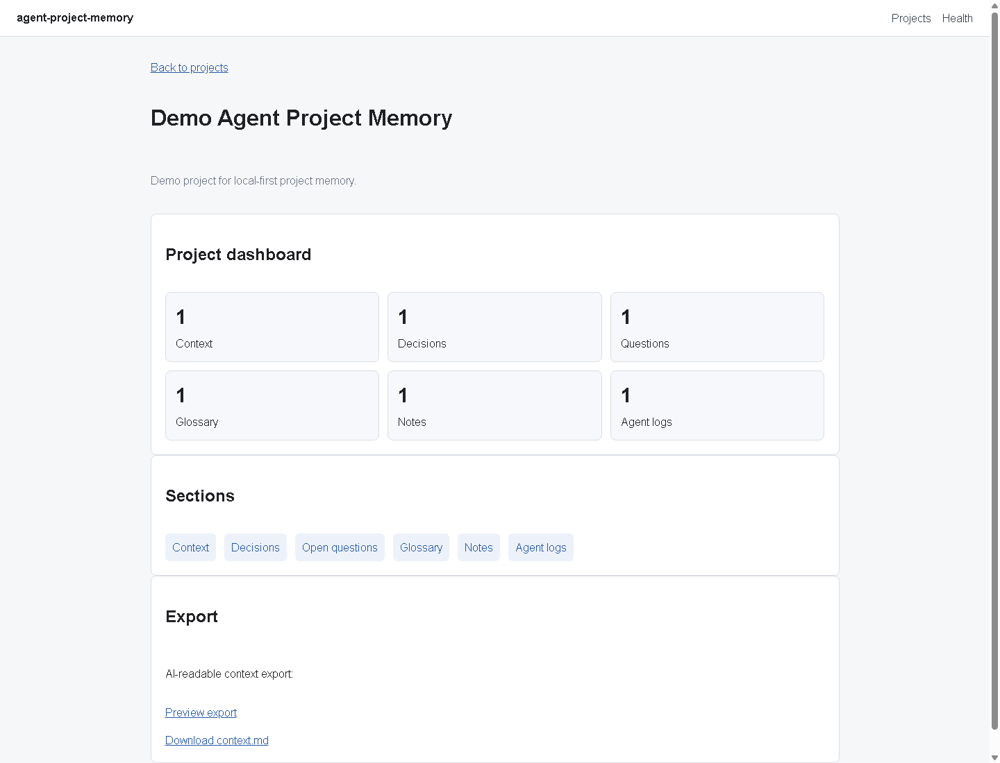

# agent-project-memory

Local-first project memory for human maintainers and AI coding agents.

`agent-project-memory` is an early-stage OSS tool for keeping the durable context of a software project in one local, reviewable place. It is designed for maintainers who work with AI coding agents across many sessions and need a stable source of truth before anyone starts changing code.



## Problem

AI coding agents can write code, review changes, and generate documentation, but they often lose project context between sessions.

In long-running projects, important knowledge gets scattered across chats, IDE notes, terminals, issues, README files, docs, and ad hoc scratch files:

- Decisions
- Assumptions
- Open questions
- Project-specific terminology
- Architecture direction
- Previous agent work logs
- Current and outdated specifications

When that memory is fragmented, Codex, Gemini, Claude, Cursor, and human maintainers can easily work from stale assumptions or incorrect interpretations.

## Solution

`agent-project-memory` stores the project's working memory in a local SQLite database and exposes it through a small Flask app.

The MVP focuses on practical, AI-readable project memory:

- Keep canonical project context separate from transient chat.
- Record product and technical decisions with rationale.
- Track unresolved questions instead of hiding uncertainty.
- Maintain a glossary of project terms.
- Capture notes and agent work logs.
- Export a deterministic `context.md` file that humans and coding agents can read before work.

The tool is intentionally local-first. The MVP has no accounts, no cloud sync, no GitHub integration, and no LLM API dependency.

## Features

Current MVP features:

- Project records
- Canonical context entries
- Decisions
- Open questions
- Glossary terms
- Notes
- Agent work logs
- AI-readable Markdown context export
- Minimal server-rendered Web UI
- Local REST API
- SQLite persistence
- pytest coverage
- GitHub Actions CI

Not implemented in the MVP:

- Authentication
- Hosted or cloud sync workflows
- GitHub Issues or PR integration
- LLM API calls
- Multi-user permissions
- Semantic search

## Quick Start

Requirements:

- Python 3.11 or newer
- `pip`

Create and activate a virtual environment:

```powershell
python -m venv .venv
.\.venv\Scripts\Activate.ps1
```

Install with development dependencies:

```powershell
python -m pip install -e ".[dev]"
```

Initialize the local database:

```powershell
python -m agent_project_memory --init-db
```

Run the app:

```powershell
python -m agent_project_memory
```

Open:

- Web UI: `http://127.0.0.1:5000/`
- Health API: `http://127.0.0.1:5000/api/health`

## Run Locally

After installation, start the local Flask app:

```powershell
python -m agent_project_memory
```

The top-level compatibility entry point also works:

```powershell
python app.py
```

After editable installation, the console script may be available:

```powershell
agent-project-memory
```

If the Python scripts directory is not on `PATH`, prefer `python -m agent_project_memory`.

## Initialize Database

Initialize or reinitialize the local SQLite schema:

```powershell
python -m agent_project_memory --init-db
```

The command is safe to run more than once. By default, local data is stored at:

```text
.agent-project-memory/memory.sqlite
```

Override the database path with:

```powershell
$env:APPM_DATABASE_PATH="path\to\memory.sqlite"
python -m agent_project_memory --init-db
```

Optional demo data for manual smoke testing:

```powershell
python -m flask --app agent_project_memory.app seed-demo
```

## Run Tests

Run the full test suite:

```powershell
python -m pytest
```

GitHub Actions runs:

```powershell
python -m pip install -e ".[dev]"
python -m pytest
```

## Web UI

The Web UI supports the current MVP workflow:

1. Create a project.
2. Open the project dashboard.
3. Add context entries, decisions, open questions, glossary terms, notes, and agent logs.
4. Preview the generated `context.md`.
5. Download the export for use before a human or AI coding session.

## API Examples

Health:

```powershell
Invoke-RestMethod -Uri "http://127.0.0.1:5000/api/health"
```

Create a project:

```powershell
Invoke-RestMethod `
  -Uri "http://127.0.0.1:5000/api/projects" `
  -Method Post `
  -ContentType "application/json" `
  -Body '{"name":"Agent Project Memory","slug":"agent-project-memory","description":"Local-first project memory."}'
```

List projects:

```powershell
Invoke-RestMethod -Uri "http://127.0.0.1:5000/api/projects"
```

Create a context entry:

```powershell
Invoke-RestMethod `
  -Uri "http://127.0.0.1:5000/api/projects/1/context" `
  -Method Post `
  -ContentType "application/json" `
  -Body '{"section":"summary","title":"Summary","body":"Canonical project context.","position":1}'
```

Create a decision:

```powershell
Invoke-RestMethod `
  -Uri "http://127.0.0.1:5000/api/projects/1/decisions" `
  -Method Post `
  -ContentType "application/json" `
  -Body '{"title":"Use SQLite","status":"accepted","decision":"Use SQLite for local-first MVP storage."}'
```

Create an open question:

```powershell
Invoke-RestMethod `
  -Uri "http://127.0.0.1:5000/api/projects/1/questions" `
  -Method Post `
  -ContentType "application/json" `
  -Body '{"title":"Export scope","status":"open","question":"What should the first export include?"}'
```

Create a glossary term:

```powershell
Invoke-RestMethod `
  -Uri "http://127.0.0.1:5000/api/projects/1/glossary" `
  -Method Post `
  -ContentType "application/json" `
  -Body '{"term":"Canonical Context","definition":"The current authoritative project context."}'
```

Create a note:

```powershell
Invoke-RestMethod `
  -Uri "http://127.0.0.1:5000/api/projects/1/notes" `
  -Method Post `
  -ContentType "application/json" `
  -Body '{"title":"MVP note","body":"Keep the MVP small."}'
```

Create an agent log:

```powershell
Invoke-RestMethod `
  -Uri "http://127.0.0.1:5000/api/projects/1/agent-logs" `
  -Method Post `
  -ContentType "application/json" `
  -Body '{"agent_name":"Codex","summary":"Completed a focused task.","checks_run":"python -m pytest"}'
```

## Context Export

Export AI-readable context:

```powershell
Invoke-WebRequest `
  -Uri "http://127.0.0.1:5000/api/projects/1/export/context.md" `
  -OutFile "context.md"
```

The export is deterministic Markdown with this section order:

1. Project overview
2. Canonical context
3. Decisions
4. Open questions
5. Glossary
6. Notes
7. Agent logs

Included by default:

- All canonical context entries, ordered for display/export.
- Decisions with `accepted` or `proposed` status.
- Questions with `open` or `deferred` status.
- All glossary terms.
- Notes in newest-first order.
- Agent logs in newest-first order.

Excluded by default:

- Decisions with `superseded` status.
- Questions with `answered` status.

## Screenshots

The screenshot above shows the MVP project dashboard with memory-section navigation and record counts. It was captured from the local Flask Web UI using seeded demo data.

## Development Workflow

This repository uses control documents to keep human maintainers and AI coding agents aligned:

- Read `AGENTS.md`, `CONTEXT.md`, `DECISIONS.md`, `TASKS.md`, `STATUS.md`, `OPEN_QUESTIONS.md`, and `GLOSSARY.md` before change work.
- Keep changes small and focused.
- Prefer one task per commit.
- Run `python -m pytest` before committing.
- Update `STATUS.md` after each work session.
- Update `TASKS.md` when a task is completed or blocked.
- Do not commit generated SQLite databases, caches, virtual environments, or build metadata.

See [CONTRIBUTING.md](CONTRIBUTING.md) for setup, testing, task workflow, and PR expectations.

## Project Structure

```text
.
├── app.py
├── pyproject.toml
├── requirements.txt
├── docs/
│   └── assets/
│       └── screenshot.png
├── src/
│   └── agent_project_memory/
│       ├── api.py
│       ├── app.py
│       ├── db.py
│       ├── export.py
│       ├── repositories.py
│       ├── schema.sql
│       ├── seed.py
│       ├── static/
│       │   └── styles.css
│       └── templates/
└── tests/
```

## License

This project is licensed under the MIT License. See [LICENSE](LICENSE).
